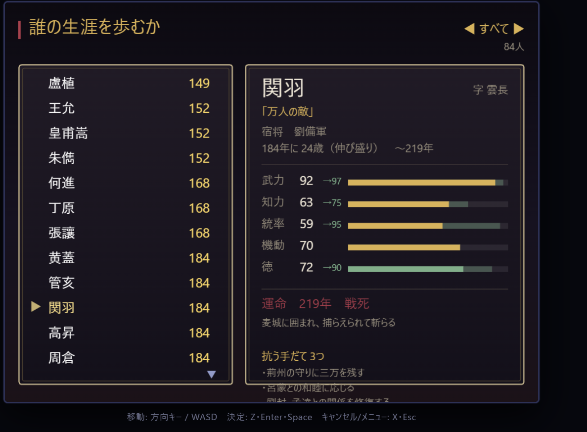

# 三國志 逆天録

> 謀事は人に在り、成事は天に在り —— その天に、抗う。

三国志の武将ひとりひとりが、いつ生まれ、誰の旗の下に立ち、どの戦に居合わせ、どう死んだのか。
**それを知るためのゲーム**であり、そのうえで**違う道を歩んだらどうなるか**を試すためのゲーム。



**▶ ブラウザですぐ遊べます — https://nw-work-commits.github.io/gyakutenroku/**

八十四人の誰でも、いつでも、人物事典から生涯を引ける。そして誰にでもなれる。

ブラウザで動く。TypeScript + Vite、**素材ファイルなし**——絵は canvas の線と面で組み、音は WebAudio で合成している。

## 動かす

```bash
npm run dev
```

`npm run build` で `dist/` に出力、`npm run typecheck` で型チェックのみ。

## そうさ

| | キー |
|---|---|
| 移動 | 方向キー / WASD |
| 決定・話す・調べる | Z / Enter / Space |
| 兵の割り振り・隊長を替える | 戦の支度で左右 |
| 年代記をひらく | X / Esc |
| 年代記 ⇄ 世情 ⇄ 手控え | 左右 |
| 記録を残す・初めの画面へ | 年代記の「手控え」 |
| 人物事典 | タイトル、年代記で決定、町で人に話しかける |
| 伝から伝へ辿る | 伝を読みながら決定 → 左右で名を選ぶ → 決定 |
| 来た道を戻る | X（辿った順に一人ずつ） |

## 何をするゲームか

### まず、知る

タイトルから **人物事典** に入れる。遊ばずに読むだけでもいい。

八十四人ぶんの生涯を、持っているデータから組み立てる。ただし**知らないことを知っているように書かない**のが此処の掟で、**一行ずつ「どの書物に書かれているか」と「真実からどれだけ隔たっているか」を持たせてある**。

```
184年 ・劉備・張飛と、恩は兄弟の如く交わる〔正史・関羽伝〕
        正史では——「恩は兄弟の若く、寝るときは牀を同じくした」とあるのみ。
        桃園で義を結ぶ儀式は演義の作で、正史に誓いの場面は無い。

190年  虎牢関〔演義・創作〕
        呂布、関前に立ちはだかる。劉備・関羽・張飛、三人がかりでようやく退ける
        正史では——三英が呂布と渡り合った記述は無い。
        董卓軍を破って洛陽へ迫ったのは孫堅で、華雄を斬ったのもその軍である（孫堅伝）。
```

| 色 | 意味 |
|---|---|
| 金 | 正史の記載 |
| 青 | 異説（裴松之注が引く別の伝えなど） |
| 橙 | 脚色（下敷きはあるが膨らませてある） |
| 朱 | 創作（下敷きが無い） |
| 灰 | 所属と年から推し量ったこと |
| 翠 | あなたが歩んだ道 |

**出典と、真実からの隔たりは別の軸**で持っている。演義にしか無い話でも、下敷きのある脚色（連環の計）と、まるごとの創作（三英戦呂布）とでは意味がまるで違うため。そして隔たりのある話には必ず**「正史ではどうだったか」**を並べる。そこが勉強の要になる。

出典として持っているのは、三国志（陳寿・285年）／裴松之注（429年）／後漢書（445年）／晋書（648年）／資治通鑑（1084年）／三国志演義（1400年頃）／民間伝承の七つ。書物そのものの性格も `data/sources.ts` に書いてある。

### 人から人へ辿る

伝を読みながら決定を押すと、本文に名の出てくる武将が下に並ぶ。左右で選んで決定すれば、その者の伝へ渡る。**X で来た道を一人ずつ戻れる**（右上に辿ってきた道が出る）。

```
登場   孫策  曹操  ▶諸葛亮                    馬謖 › 龐統 ›
```

索引は持たない。本文（出典の注記も含む）を読んで名前を拾うので、逸話を書き足せばそこに出てくる者への道が勝手に通る。周瑜の伝から諸葛亮へ渡れば、「既生瑜、何生亮」を演義がどちらの側から書いたかが分かる。いまの平均は一人あたり8.9人。

### 書かれていない人は、書かれていないと書く

三行しか登録していない武将にも、生涯は出る。そして**そもそも正史にいない人物**は、そう書かれる。

```
高昇                                       生年不詳 — 184年
                                                     ○○○○○
黄巾に属す。黄巾の頭目。
その人となりを伝える記述は、残っていない。

——この人物は三国志演義の創作であり、正史に見えない。
  以下は物語の中の生涯である。

年譜
 184年  黄巾の下に立つ
 184年  黄巾蜂起 / 広宗の戦い / 下曲陽の戦い / 大興山の戦い

最期
 184年、趙雲の手にかかる。青州の攻防にて。

史書が伝えないこと
 ・正史にこの者の記載は無い。三国志演義が世に出した人物。
 ・正史にこの名は無い。趙雲が世に出るのは公孫瓚のもとにあった190年前後で、
   黄巾の乱には間に合わない。
```

高昇は陳寿が書き落としたのではなく、千二百年後に羅貫中が作った人物である。**伝が薄いのではなく、書くべき人がいなかった。** 一覧にも「演義のみ」と出るので、開く前から分かる。

右上の ●○ は**正史における伝わりの厚さ**。高昇は ○○○○○、関羽は ●●●●●。物語がどれだけ厚くても、正史の厚さは別に数える。

### そのうえで、外れる

同じ一枚に、自分が歩んだ道が翠で混ざる。

```
 219年 ・樊城の水                      ← 史書
          関羽、漢水を決して七軍を沈む…
 219年 ＊荊州に三万を残し、樊城へ向かう ← あなた
          史書にこの記述なし
 219年 ＊この年を越えて生きた
          史書から外れた

最期
 219年、麦城に囲まれ、捕らえられて斬らる。
 ——然れども、あなたの関羽は、この年を越えた。
```

**知るゲームと、外れるゲームが同じ一枚になる。**

### 運命に抗う

開始時、選んだ武将に**運命が告げられる**。

> 汝、関雲長。
> 建安二十四年冬、樊城に敗れ、麦城にて首を落とされる。

以後この年が画面の隅に出続ける。RPGの「魔王を倒す」の位置に、**自分の死を回避する**が入る。

回避条件は隠されず、最初から示される。

```
抗う手だて                      1 / 3
☑ 荊州の守りに三万を残す
☐ 呂蒙との和睦に応じる
☐ 劉封・孟達との関係を修復する
```

すべて満たせば史書から外れて生き延び、満たせなければ史実どおりに死ぬ。**どちらも結末として認める。**

そして最後に、**やったことから列伝が生成される**。

```
呂布伝

呂布、字は奉先。世に「人中に呂布あり、馬中に赤兎あり」と称さる。
　198年、仇敵と和を結ぶ。**然れども、史書にこの記述なし。**
　史に曰く、199年、白門楼にて縊り殺さる。
　**然れども、その者はこの年を越えて生きた。**
```

## 主な仕組み

**能力値は固定、年齢で熟す。** 呂布は最初から武力100……ではなく、それは「完成形」。武力と機動は25歳で全盛・42歳から衰え、知力と統率は遅く伸びて長く保つ。孫策を16歳で始めれば武力52、25歳で92になる。

**道は選ぶもの。** 一歩に食う日数が土地で違う。街道と平野は一日、森と丘と砂は二日、渡しは三日。許昌から江陵へは、歩数だけなら18歩の道があるが、**最短の日数は21日で、それは別の道**になる。遠回りでも街道を辿るほうが早いことがあり、しかも街道は賊に襲われにくい。険しい土地は守りやすいが動きにくい、という戦の理屈とそのまま噛み合っている。

**この遊びの目当ては三つある。** 一人の武将として乱世を生き、**ほかの武将の生涯を見届け**、史書をどれだけ外せるか。一生が閉じると**結びの一景**が開き、どこまで昇ったか・史書に無い事柄をいくつ残したか・幾人の生涯を見届けたかを、順に数え上げる。三つ目を最後に置いてあるのは、それがこの遊びの本題だから。天下を取った者より、八十三人の生涯を最後まで読んだ者のほうを讃える。

一生の閉じ方は四つ。**討たれる**／**天寿を全うす**（史書の外まで生きた者に来る老い）／**世の終わりまで**（280年）／**天下、一つとなる**。手控えには常に「見届けた生涯 N/83」と「史書に無い事柄 N」が出ているので、遊びながら自分がどこにいるか分かる。

**運命の日を越えた者は、越えたところから先を生きる。** かつてはここで幕が引かれていたが、それでは「史書と違う道を進んだらどうなるか」がその道に入った瞬間に終わってしまう。史書から外れた生涯は、外れてからが本番である。

**居合わせるかは位置で決まる。** 73の史実イベントに州が割り当てられている。荊州にいなければ赤壁には出られず、出なければ史実どおりに終わる。

**一騎討ちは「捕らえるか、死」。** 武力差が開いているほど捕らえられ、**互角ほど死ぬ**（圧倒していれば殺さずに済むが、互角なら必死になって斬る）。呂布と張飛は69%が「勝負つかず」。
消耗は戦のあいだ回復しないので、**代わる代わる挑めば格上も削れる**（三英で呂布を倒せる確率62%、雑魚3人なら0%）。

そして**出るのは自分とは限らない**。名乗りを上げるのはその隊を率いている者なので、関羽に隊を預けて一騎討ちを命じれば関羽が出る。武力の高い配下を前に置けば顔良にも勝てるが、負ければその者を失う——名簿から消え、世界の帳簿にも没年が刻まれる。誰を隊長に据えるかが、そのまま誰を賭けるかになる。

**賊を討って身を起こす。** 布衣は兵も名も持たない。支度金ひと山（120金）で六十の兵を募り、いちばん弱い砦を落とし、降った賊をそのまま自分の兵にする。曹操の青州兵も、劉備の最初の一隊も、もとを辿ればこれである。

砦の湧き方は表で持たず、**州の荒れ具合**から出す。旗の立たない州は荒れ、小勢力は隅々まで見きれず、黄巾の三十六方が置かれた六州はことに荒れる。つまり[世界のうつろい](#何をするゲームか)がそのまま賊の分布になり、地図を見れば「いまどこが無法か」が分かる。八年経てば別の一党が同じ山に入る。

統率の低い者は兵の上限で頭打ちになるので、**位を上げることが唯一の出口**になる（弱い砦を三つ落とせば布衣を脱し、兵の上限が倍になる）。

**世界は待ってくれない。** 居合わせなかった事件は、裏で勝手に決着する。武将は実際に死に、城は主を変え、勢力は滅びる。184年から280年まで放っておくと、報せが300本ほど流れて、天下は晋のもとに一つになる。地図は州ごとに支配勢力の色で染まっているので、**歩いているだけで版図が塗り替わっていくのが見える**。

主家が消えたときは、代替わりならその跡目に移り（劉備軍→蜀漢）、併呑ならば無所属に戻る（蜀漢→魏）。

**戦場は立っていた土地の上にある。** 世界地図のどのマスから戦に入ったかが渡るので、赤壁は対岸と波の上、剣閣は山あい、城下なら城壁を背にして戦う。空も地面も遠景も変わる。

そして**見た目だけでなく、数字も変わる**。森では木が矢を止め馬が進めない（騎馬の威力 −45%、弓 −40%）。水辺では足を取られ、代わりに火が一・六倍で回る。関前に拠れば守備が一・六倍固くなり、数の差が意味を失う。編成の画面に ◎○△✕ で出るので、**どこで戦うかを決めてから連れて行く兵を選べる**。

**兵科は三すくみ＋α。** 歩兵→騎馬→弓→歩兵。藤甲兵は刀も矢もほぼ通さないが、火は白兵の13倍で通る。

**暗殺は兵科ではなく策略。** 千の刺客を養う者はいない。放つのは常にひとりかふたりで、だから「暗殺部隊」という隊は無く、どの隊からでも計略として放てる。成る見込みは知力差で決まり、諸葛亮が夏侯淵の陣に放って三割強、張飛が司馬懿を狙えば一分。失敗すれば刺客は帰らず、成っても徳が7下がる。そして**刺客は本陣までは届かない**——狙えるのは前に出ている将までで、敵の大将を寝所で刺して戦を終わらせることはできない。徳の薄い相手はこちらの配下を同じ手で狙ってくる。

**兵科には得手不得手がある。** 馬超に騎馬を預ければ二割強く当たり、曹仁に歩兵を預ければ一割崩れにくい。ただしここは慎重に二段に分けてある。白馬義従の公孫瓚、「弓馬に便し」と正史が書いた呂布、「猿臂善射」の太史慈——**史料の裏がある者だけ手で書き**、残りは能力値から推し量る。画面には必ず「史にそう見える」「史には見えぬ。当てにはならぬ」と添えるので、遊びの都合の数字を史実と取り違えることはない。演義由来の逸話（黄忠の弓など）は書いていない。

**配下は隊を率いる。** 登用した武将は名簿に載るだけではない。**その者の統率の半分だけ兵の上限が伸び**（関羽・張飛・趙雲を連れた劉備は3511→9006）、戦では隊長として前に立つ。部隊の攻めと守りはその隊長の武力・統率と、その兵科への得手不得手で決まる。

出陣の支度は二段。まず**兵科ごとに何隊出すか**を決める（騎馬を二隊に割れば、二人の将にそれぞれ預けられる）。次に**誰にどの隊を預けるか**。自動の割り振りは組み合わせ全部を見て相性のよい対から決めるので、馬超がいれば騎馬に、諸葛亮がいれば弓に立つ。左右で隊長を入れ替えると、その者の武力・統率・知力・徳、兵科の適性、向き不向きの一言が出る。ひとりが二隊は率いられないので、選ぶことは必ず何かを諦めることになる。

そして**失うこともある**。隊が全滅すれば隊長も無事では済まない（統率95の関羽で17%、統率62の張飛で33%）。討たれれば名簿から消え、世界の帳簿にも死んだ年が記される——以後その者は町に立たず、人物伝にも史実と違う没年が残る。

**城は取れる。旗は挙げられる。** 他家の城で「この城を攻める」を選べば守兵と一戦になり、勝てば旗が変わる。城を持ち名声250に届けば**自らの勢力を興せる**——史書に無い勢力なので、世界の差分として持ち歩き、読み込むたびに勢力名簿へ足し直す。主家が既に滅んでいる者（公孫瓚亡きあとの趙雲など）が城を取れば、その城のほうが新しい旗になる。全城を握れば「天下、一つとなる」で一生が閉じる。

**世界の側でも戦は起きる。** ただし**何もしていない盤面では一度も動かない**——誰も史実を曲げていなければ、天下は史書どおり晋のもとに一つになる（世界の戦0件）。版図が史実と食い違ったときにだけ目を覚まし、そこから先は「持っている城」と「生きている将」で勝負を決める。官渡で袁紹を勝たせれば、袁紹は虎牢関から洛陽、長安へと西に押し、280年になっても呉が江東に残る。

攻め込める間合いは隣の州まで（地図の座標から出す）。取ったばかりの城は四年は落ち着かず、守るほうには城の利がある——だから戦線は年に一つ動くかどうかで、毎年ひっくり返ることはない。**自分の城も狙われる**が、自分が居る州だけは守れる。絶対に取られないなら天下統一はただの作業になるし、遠くの戦で城を失って何もできないのでは理不尽だから、「そこに居れば守れる」という一線だけを引いてある。

**兵は食う。** 兵糧（石）はひと月に兵九十人あたり一石。仕官していれば位に応じて主君から給わり、自立していれば城の実りか市で贖う。尽きれば兵は斬られるのではなく、**去っていく**。これで四つの死んでいた仕掛けが繋がった——市に用ができ、金が資源になり、仕官に見返りが生まれ、時を使うことに値が付いた。米の相場は州と年から出す（益州は安く涼州は高い、乱世は高く治世は安い）。位に見合った軍なら給付でほぼ賄えるが、人を集めて軍を膨らませたぶんは自腹になる。

**配下には心がある。** 迎えた者は主の生き方を隣で見ている。心は**徳に従って動く**が、動き方はその者の徳による——関羽や趙雲は主の不義に強く傷つき、主の義に強く応える。張飛や賈詡は「乱世です。是非を言うても始まらぬ」で済ませる。刺客を放てば、その場で一人ずつ反応が返る。心が尽きた者は黙って陣を去る（徳12の呂布で始めると、陳宮は二年で離れる）。去られても世界の帳簿に死は刻まない——その者はどこかで生きている。

**徳は登用と士気に効く。** 徳100の劉備でも呂布を落とせるのは41%。捕らえられたとき、相手の徳が高ければ助命される。

**事典は、遊んでいる最中に引ける。** 事件の本文に名の出ている者は X で開けるし（「陸抗の遺言」を読みながら陸抗の生涯へ）、一騎討ちの最中も相手の伝を引ける。町で会った者からも辿れる。読んだ伝は一覧に「読」の印が付き、「84人　うち見届けた 7人」と数え上げられる。

## ソースの地図

```
src/
  main.ts                 起動とゲームループ
  engine/                 シーン管理・入力・描画・音・乱数（ゲームの中身を知らない層）
  chronicle/
    types.ts              全体の型
    app.ts                状態・シーン・入力の持ち主
    abilities.ts          能力値の自動生成と年齢による熟成
    rules.ts              兵力・士気・登用・出世の式（バランス調整はここ）
    biography.ts          列伝の生成と運命の予兆
    lore.ts               人物伝の生成（出典・真実からの隔たり・伝えないこと）
    runner.ts             居合わせ判定・選択の適用・年送り・運命の判定
    registry.ts           ファイルを置くだけで自動登録
    validate.ts           整合性チェックと、回避条件の到達性監査
    systems/
      duel.ts             一騎討ち・捕縛・捕虜の処遇
      war.ts              部隊戦・命令・計略
      calendar.ts         暦（一歩＝一〜三日。土地で変わる）
      world.ts            居合わせなかった年の決着・版図・訃報
      bandits.ts          賊の砦の湧き方（州の荒れ具合から出す）
    data/
      officers/           武将84人・出典付きの逸話181行（全員に手が入っている）
      timeline/           史実イベント73本（184〜280年・51の年を覆う）
      fates/              運命の型5種（戦死・処刑・病没・暗殺・天寿）
      world/              世界地図・地形・事件の場所・城市の主の変遷
      sources.ts          出典の書物7種（三国志・裴注・後漢書・晋書・通鑑・演義・伝承）
      roles.ts            役柄16種 ← 能力値の自動生成レンジ
      ranks.ts            布衣→…→大将軍→君主
      units.ts            兵科4種（暗殺は策略へ移した）
      factions.ts         勢力20
    scenes/
      avatar.ts           地図と町を歩く人（四方向・歩き・陰影）
      troops.ts           一隊を兵の集まりとして描く（兵科ごとの構えと動き）
      duelists.ts         一騎討ちの二騎（馬・騎手・得物）
      scenery.ts          地形と建物と戦場の下地（山・森・水・城市・家・幟）
      title / select / lore / prologue / world / annals / event / battle / fate / biography
```

### いじるときの目安

- **武将を足す** … `data/officers/` に3行足すだけ。能力値は役柄から自動生成される
- **逸話を足す** … 武将に `life` を書く。一行ごとに出典と隔たりが要る（下記）
- **史実イベントを足す** … `data/timeline/` にファイルを置く。索引の書き換えは不要
- **強さの調整** … `rules.ts` と `systems/formula` 系の係数
- **地形の効き** … `data/world/terrain.ts` の `BATTLE_GROUND`（兵科ごとの倍率・守備・火の回り）
- **兵科の適性** … 史料の裏があるものは `officer.aptitude`、無いものは `systems/aptitude.ts` が推し量る
- **一生の結び** … `ending.ts`（数え上げ）と `scenes/ending.ts`（四景）
- **兵糧と俸禄** … `systems/provisions.ts`（相場は州と年から出す）
- **配下の心** … `systems/hearts.ts`（徳に従って動き、尽きれば去る）
- **自勢力** … `WorldState.founded` と `systems/world.ts` の `foundFaction`
- **世界の側の戦** … `systems/campaign.ts`（史実と食い違ったときだけ動く）
- **討伐の実入り** … `rules.ts` の `spoilsOf`。賊の頭数は `systems/bandits.ts` の `TROOPS_BY_STRENGTH`
- **地形を変える** … `data/world/overworld.ts`。山・河・街道を宣言的に塗っている
- **城の持ち主を直す** … `data/world/control.ts`。城市ごとに「何年から誰のもの」を並べる

### 逸話を書き足す

```ts
life: [
  {
    year: 200, text: '賜わったものをことごとく封じ、書を残して劉備のもとへ去る',
    attribution: {
      work: 'sanguozhi', standing: 'record', locus: '関羽伝',
      insteadTruly:
        '五関を突破して六将を斬った話は演義の作。正史は「賜わる所を尽く封じ、' +
        '書を拝して辞し、先主のもとへ奔る」と書くのみで、曹操は追わせなかった。',
    },
  },
],
```

`work` が**どの書物か**、`standing` が**真実からの隔たり**（`record` / `variant` / `dramatized` / `invention`）。`insteadTruly` は隔たりがあるときに並べる正史の側で、**創作と書いておきながらこれを省くと検証が弾く**。演義だけの人物には `fictional: true` と人物そのものの `attribution` が要り、そういう人物に正史由来の逸話を付けようとしても弾かれる。

年表の事件を自分の言葉で語り直すときは `supersedes: 'ev_changban'` を添える。その事件の「居合わせたはず」の灰色行が引っ込むので、同じ場面が二度出ない。なお**創作と印を付けた事件は、そもそも推測に上がらない**（起きなかった出来事に「居合わせたはず」は成り立たないため）。

### 世界を動かす書き方

事件や選択肢に `aftermath` を足すと、世界の側にその痕跡が残る。書くのは**史書と違うことだけ**でよい（誰がその年に死ぬかは武将の没年から、城が誰に渡るかは `control.ts` から勝手に出る）。

```ts
// 呂布の助命を勧める選択肢に足す
effect: {
  deed: '呂布の助命を勧める',
  aftermath: { spares: ['lvbu'], news: '呂布、死を免れて曹操に降る' },
}
```

これだけで呂布は199年を越えて生き、下邳の町に立ち続け、酒楼の噂と年代記の「現状」欄と列伝の結びに、その一行が出る。`slays` は史実より早い死、`seize` は城の主替えに使う。存在しない武将や城市を書けば、起動時の検証が拾う。

開発モードでは起動時にデータ検証が走り、`window.__rpg`（`app` / `run` / `chronicle()`）からコンソールで状態を覗ける。本番ビルドには含まれない。

## 町でできること

動詞をメニューに並べず、**場所**に紐づけている。

| 場所 | できること |
|---|---|
| 城 | **仕官**（名声30以上で、その城の主の旗に加わる） |
| 兵舎 | **徴兵**（兵ひとり二金・ひと月）。城市にしかない |
| 酒楼 | **噂**（自分がいないあいだに何が起きたか、その年どこで何が起きるか） |
| 宿 | **休息**（ひと月・統率に応じて兵が戻る） |
| 市 | 買い物（装備は未実装） |

町にいる武将は表で持たず、「その年に生きていて、その勢力の本拠がこの城」から実行時に決まる。話しかければ能力と歳が分かり、**招く**と徳で判定され、**生涯を聞く**とその者の人物伝がひらく。道で会った名も知らぬ武将こそ、史書が何を伝えていないかを読む値打ちがある。

## まだ無いもの

- 修練・調練（兵舎で兵を鍛える、士気を上げる）
- 空白年（235〜248年など）
- 色仕掛け・離間、装備（赤兎馬・青龍偃月刀）
- **勢力どうしが自分から戦わない**（城の移り変わりは史実の筋書きをなぞる。自分が版図を変えたぶんは残るが、そこから先を勢力が自力で押し返すことはない）
- **人物伝の厚みが人によって違う**（84人全員に手は入っているが、逸話の行数は劉備の7行から張梁の2行まで幅がある）
- **年表にまだ穴がある**（いちばん長いのは265〜272の6年。かつては235〜248の14年が空いていた）
